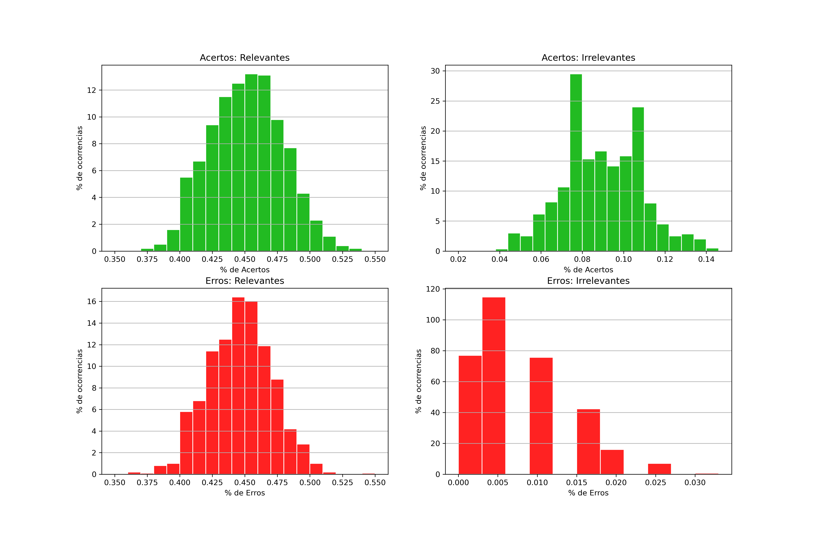

# Classificador Naive Bayes
[Prof. Maria Kelly](https://github.com/KellyVene), [Insper](https://github.com/Insper), 2021.

### Classificador Automático de Sentimento
> Você foi contratado por uma empresa parar analisar como os clientes estão reagindo a um determinado produto no Twitter. A empresa deseja que você: crie um programa que selecione algumas mensagens disponíveis no Twitter, as quais mencionam esse particular produto; e classifique esses tweets como "relevante" ou "irrelevante", pelo menos.

> Com isso, essa empresa deseja que mensagens relevantes, que denigrem o nome do produto, ou que mereçam destaque, por exemplo, disparem um foco de atenção da área de marketing. Como aluno de Ciência dos Dados, você lembrou do Teorema de Bayes, mais especificamente do Classificador Naive-Bayes, que é largamente utilizado em filtros anti-spam de e-mails, por exemplo. Esse classificador permite calcular qual a probabilidade de uma mensagem ser relevante dada as palavras em seu conteúdo.

> Para realizar o MVP (minimum viable product) do projeto, você precisa implementar uma versão do classificador que "aprende" o que é relevante com uma base de treinamento e compara a performance dos resultados com uma base de testes. Após validado, o seu protótipo poderia, porque não, também capturar e classificar automaticamente as mensagens da plataforma.

### Qualidade do classificador

